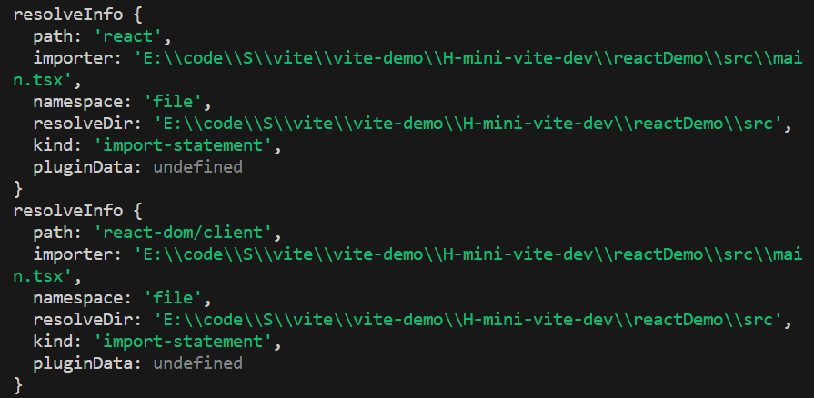

# mini-vite

## 开发环境搭建

### 一些依赖的基本用法

以下是开发中需要使用到的一些依赖

```json
"dependencies": {
    "cac": "^6.7.14", // 用于自定义 cli 指令，根据命令行中输入的指令执行对应的函数
    "chokidar": "^3.5.3", // 用于监听文件的变化
    "connect": "^3.7.0", // HTTP 服务器框架
    "debug": "^4.3.4", // 调试工具
    "es-module-lexer": "^1.4.1", // 解析 esm 中的 import/export
    "esbuild": "^0.19.11", 
    "fs-extra": "^11.2.0", // fs-extra 是一个强大的文件操作库， 是 Nodejs fs 模块 的增强版；
    "magic-string": "^0.30.5", // 用于操作字符串生成源映射
    "picocolors": "^1.0.0", // 在终端输出带颜色的信息	
    "resolve": "^1.22.8", // 解析路径
    "rollup": "^4.9.4",
    "sirv": "^2.0.4", // 处理静态资源
    "typescript": "^5.3.3",
    "ws": "^8.16.0"
  },
  "devDependencies": {
    "@types/connect": "^3.4.38",
    "@types/debug": "^4.1.12",
    "@types/fs-extra": "^11.0.4",
    "@types/resolve": "^1.20.6",
    "@types/ws": "^8.5.10",
    "tsup": "^8.0.1"
  }
```

### 构建脚本

使用 connect 构建开发服务器：

```src/node/server/index.ts

import connect from 'connect'
import {green, blue} from 'picocolors'

export async function startServer() {
  const app = connect()
  const startTime = Date.now()
  app.listen(3000, async () => {
    console.log(green(`Server started in ${Date.now() - startTime}ms`))
    console.log(blue(`Server running at http://localhost:3000`))
  })
}
```

使用 tsconfig 编译打包上述 ts 代码配置 tsup.config.ts:

```tsup
// tsup.config.ts
import { defineConfig } from "tsup";

export default defineConfig({
  // 后续会增加 entry
  entry: {
    index: "src/cli.ts",
  },
  // 产物格式，包含 esm 和 cjs 格式
  format: ["esm", "cjs"],
  // 目标语法
  target: "es2020",
  // 生成 sourcemap
  sourcemap: true,
  // 没有拆包的需求，关闭拆包能力
  splitting: false,
});

```

在 package.json中添加命令：

```package.json
"start": "tsup --watch",
"build": "tsup --minify"  
```

添加入口文件:

```src/node/cli.ts
import cac from 'cac'
import {startServer} from './server'

const cli = cac()

cli
  .command('launch', "start a server")
  .action(async () => {
    await startServer()
  })

cli.help()

cli.parse()
```

在 cli 中，定义了指令，在命令行中输入 "launch"，触发 startServer 函数，开启一个运行在 3000 端口的 connect 服务。

接下来开始构建脚本：输入 npm run start，会在项目目录下生成 dist 文件夹，包括:

- index.js
- index.js.map
- index.mjs
- index.mjs.map

其中 index.js 即为所求

### 使用脚本

以下准备一个 reactDemo 用于使用构建的脚本。以下是 reactDemo 的 package.json

```package.json
{
  "name": "reactDemo",
  "version": "1.0.0",
  "description": "",
  "main": "index.js",
  "scripts": {
    "test": "echo \"Error: no test specified\" && exit 1"
  },
  "keywords": [],
  "author": "",
  "license": "ISC",
  "dependencies": {
    "react": "^18.2.0",
    "react-dom": "^18.2.0"
  }
}

```

引入之前构建的脚本：

```package.json
"devDependencies": {
    "my-vite": "../"
  },
```

添加运行脚本的命令：

```
"dev": "my-vite"
```


在父级即 my-vite 下的 package.json 中添加：

```package.json
"bin": {
	"my-vite": "./dist/index.js"
}
```

在 reactDemo 下进行 pnpm i 然后 npm run dev launch 即可启动服务，由于 npm run dev launch 过于奇怪，可在 cli.ts 中将 launch 去掉，更改为：

```src/node/cli.ts
import cac from 'cac'
import {startServer} from './server'

const cli = cac()

cli
  .command('[launch]', "start a server")
  .action(async () => {
    await startServer()
  })

cli.help()

cli.parse()
```

在 cac 中，[] 中的为可选项。

## 依赖预构建

以下来专注与 my-vite 的开发。

vite 在加载项目之前会进行依赖预构建，主要过程包括

- 将其他规范如 COMMONJS、UMD 转换为 ESM
- 将分散的依赖项打包进一个文件，减少运行时的 import ,在运行过程中 import 实际上会发送一个 http 请求去请求资源，若由很多依赖嵌套会导致加载阻塞


<strong>在 vite 中每次启动 vite 项目都会在 node_modules/.vite 文件夹下多出一个产物，以下我们仅实现每次启动更新此产物。</strong>


预构建主要是使用 esbuild 及其插件，插件中主要用到的 hooks 是：

- onResolved: A callback added using `onResolve` will be run on each import path in each module that esbuild builds,即解析路径
- onLoad: A callback added using `onLoad` will be run for each unique path/namespace pair that has not been marked as external，即加载模块

以下来实现预构建，新建一个 preBundle 文件夹，在此进行依赖预构建的操作，首先需要找到入口文件，然后在入口文件中扫描所有的第三方依赖，包括入口文件中间接引入的依赖，即入口文件中依赖项的依赖，然后将所有的依赖项打包进一个文件中。

```src/node/preBundle/index.ts
import { build } from 'esbuild';

export async function preBundle() {
  // 确定入口文件
  // 扫描第三方依赖
  // 依赖打包进一个模块
}
```

以上预构建步骤需要在项目启动之前运行，即：

```src/node/server/index
app.listen(3000, async () => {
    await preBundle(process.cwd()) // 新增
    console.log(green(`Server started in ${Date.now() - startTime}ms`))
    console.log(blue(`Server running at http://localhost:3000`))
  })
```

对于 reactDemo 而言，其入口文件即为 src/main.tsx

```src/node/preBundle/index.ts
//..省略代码..//
const entryPath = path.resolve(root, 'src/main.tsx')
```

以下进入依赖扫描阶段

### 依赖扫描

依赖扫描阶段主要是使用 esbuild 与其插件中的 hooks 解析处需要进行处理的依赖，故需要一个用于依赖扫描的插件 scanDeps.ts

```node/preBundle/plugin/scanDeps.ts


import {Plugin} from 'esbuild'

export function scanDepsPlugin(): Plugin {
  return {
    name: 'my-vite:scanDepsPlugin',
    setup(build) {
        build.onResolve(
          {}, // 目前处于异常状态
          (resolveInfo) => {

          }
        ) 
    },
  }
}
```

在此阶段需要将所有的第三方依赖进行收集，用于之后处理，故需要过滤出所有的第三方依赖，即裸导入形式的依赖

新建 contants.ts，用于存放常量

```node/constants.ts
export const BARE_IMPORT_RE = /^[\w@][^:]/; // 判断依赖路径是否为裸导入
```

```scanDeps.ts


import {Plugin} from 'esbuild'
import {BARE_IMPORT_RE} from '../../constants'

export function scanDepsPlugin(dps: Set<string>): Plugin {
  return {
    name: 'my-vite:scanDepsPlugin',
    setup(build) {
        build.onResolve(
          {filter: BARE_IMPORT_RE},
          (resolveInfo) => {
            console.log('resolveInfo', resolveInfo)
            return {
              external: true
            }
          }
        ) 
    },
  }
}
```

将需要我们手动处理的依赖标记为 external，根据 esbuild hooks onLoad 的说明，esbuild 不会处理这些标记为 external 的模块，便于手动处理。

可以观察 resolveInfo 的结构：


需要记录其 path, 即：

```scanDeps.ts


import {Plugin} from 'esbuild'
import {BARE_IMPORT_RE} from '../../constants'

export function scanDepsPlugin(deps: Set<string>): Plugin {
  return {
    name: 'my-vite:scanDepsPlugin',
    setup(build) {
        build.onResolve(
          {filter: BARE_IMPORT_RE},
          (resolveInfo) => {
            deps.add(resolveInfo.path)
            return {
              external: true
            }
          }
        ) 
    },
  }
}
```

这样就收集到了需要进行构建的依赖项。

### 依赖构建


## vite 插件

### 插件容器

### 插件上下文

## 核心编译

### 入口 html 

### JS/JSX/TS/TSX 

### css

### 静态资源

## HMR 实现

### 模块依赖图

### HMR 服务端

### HMR 客户端

